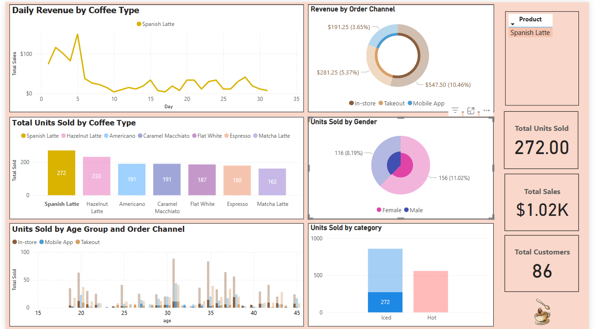
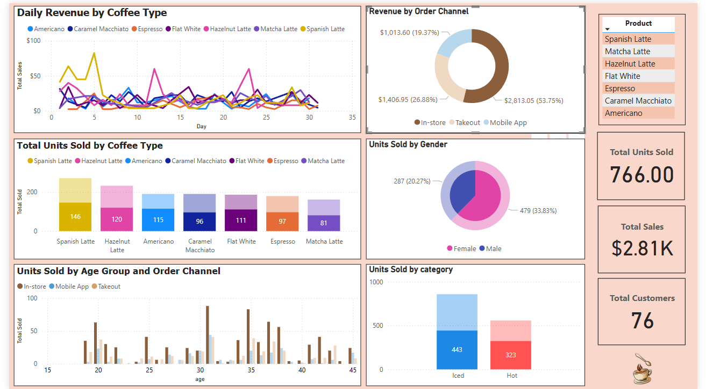
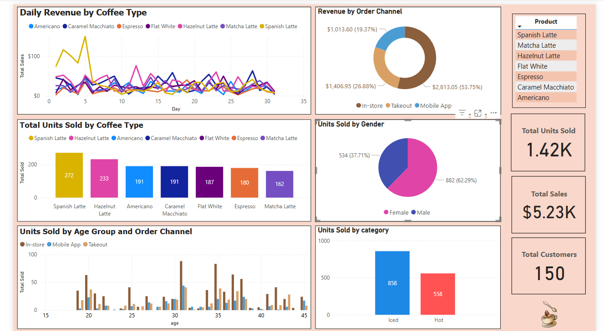
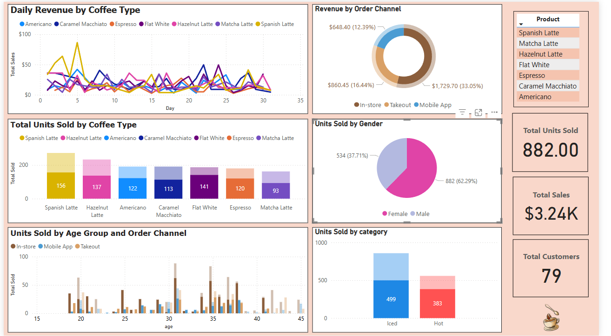

# ☕ Coffee Sales Dashboard (Power BI)

Welcome to the **Coffee Sales Dashboard** — a data visualization and analysis project built using **Power BI**. This dashboard explores coffee product performance, customer demographics, and sales trends to support data-driven decisions in a retail coffee business.

---

## 📌 Project Objective

The primary goals of this project are to:

- Model and visualize coffee sales data using Power BI  
- Track coffee product performance over time  
- Explore customer behavior and order channels  
- Practice creating DAX measures and effective dashboards  

---

## 🗂️ Data Overview

The dataset consists of three structured CSV files:

- `coffee_sales.csv` – sales transactions (price, quantity, date, product ID, customer ID, channel)  
- `coffee_products.csv` – coffee product information  
- `coffee_customers.csv` – customer demographics  

These were first formatted in Excel and then imported into Power BI.

---

## 🧩 Data Modeling

A simple star schema was created in Power BI:

- **One-to-many** relationship between `coffee_products` and `coffee_sales` via `product_id`  
- **One-to-many** relationship between `coffee_customers` and `coffee_sales` via `customer_id`

This enables interactive and responsive data visualizations across tables.

---

## 📊 Key Measures (DAX)

To support insights, the following DAX measures were created:

DAX
Total Sales = SUMX(coffee_sales, coffee_sales[price] * coffee_sales[quantity])

Total Sold = SUM(coffee_sales[quantity])

---

## 🔍 Key Insights

The dashboard reveals several valuable insights:

- **Spanish Latte** is the best-selling product with **272 units sold**, generating **₱1.02K** in revenue  
  

- **In-store** orders contribute the highest revenue, while the **application** channel generates the least  
  

- The **Iced** category leads in total units sold  
  

- **Female customers outnumber male customers**, suggesting a key customer segment  
  

- The company needs more engagmenet in their application

These insights demonstrate how data can guide product, marketing, and channel decisions. And there’s more to explore within the dashboard!

---

## 🛠 Tools Used

- **Power BI Desktop**  
- **Microsoft Excel** (for data preparation)  
- **DAX (Data Analysis Expressions)**  

---

## 📎 Screenshots

*Add screenshots of your Power BI dashboard here to showcase your visuals.*

---

## 📁 Folder Structure

